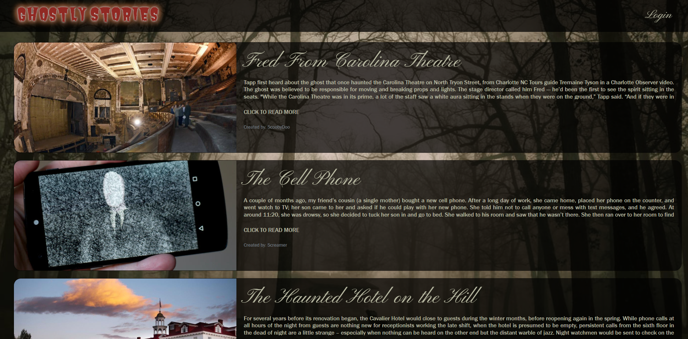
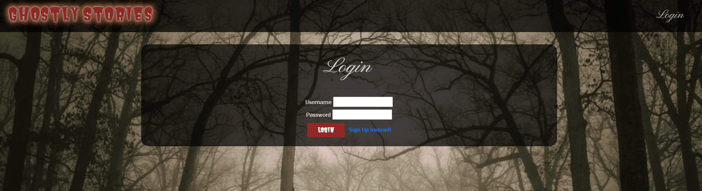
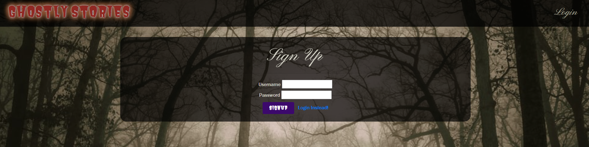
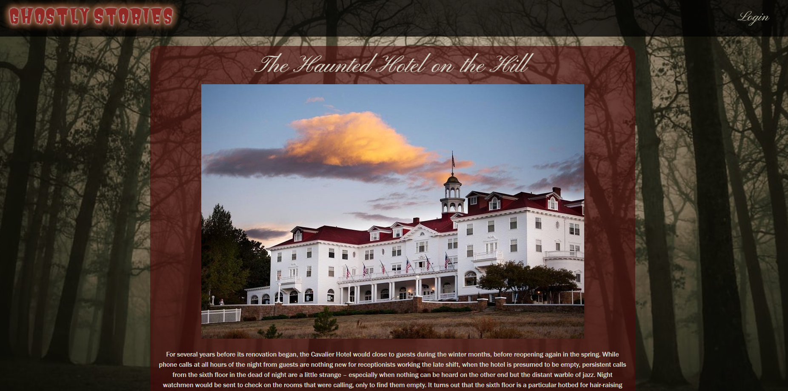
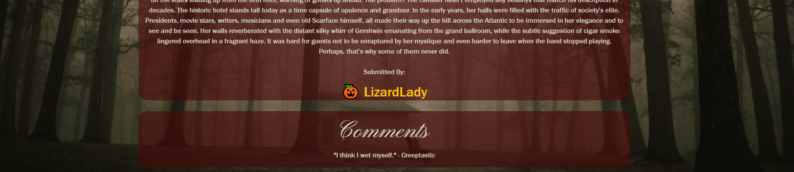
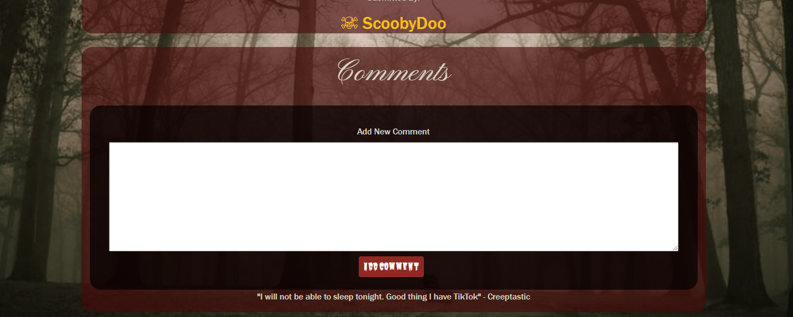
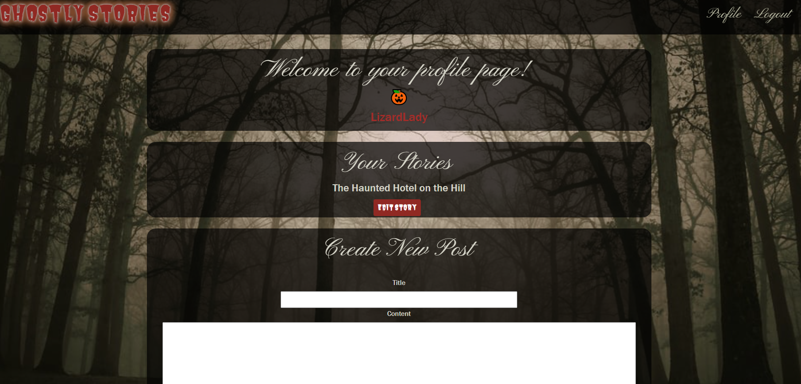

# Ghostly Stories

## Table of Contents

* [Description](#description)
* [Usage](#usage)
* [Screenshot](#screenshots)
* [Contributors](#contributors)
* [License](#license)
* [Questions](#questions)

#
## Description
For this project we created a Ghostly Stories Blog. Visitors to our blog can read ghostly stories submitted by other users. Visitors are welcome to browes the blog but must sign up or login to interact with the blog posts. Once a user has signed up with a username and password a profile will be created, users then have the ability to leave comments on other stories. The users profile with show any stories the user has published to the blog and has the functionality to edit or delete any of their currenlty posted stories, or add new stories. 
#
## Usage
Interactive blog that hosts a community of ghosty story enthusiasts.
[Deployed Site](https://ghostly-stories-10-4-2021.herokuapp.com/)
#
## Screenshots
Home Page- Before Login

Login Page

Signup Page

View of a single story- Before Login

Single Story- After Login

Profile

#
## Contributors 
Ashby Blakely [GitHub](https://github.com/AshbyLB), &nbsp;Asante Cureton [GitHub](https://github.com/asantercureton), &nbsp;Ariell Scott [GitHub](https://github.com/as98250), &nbsp;Laura Weiner [GitHub](https://github.com/lweine01)
#
## License
MIT
#
## Questions